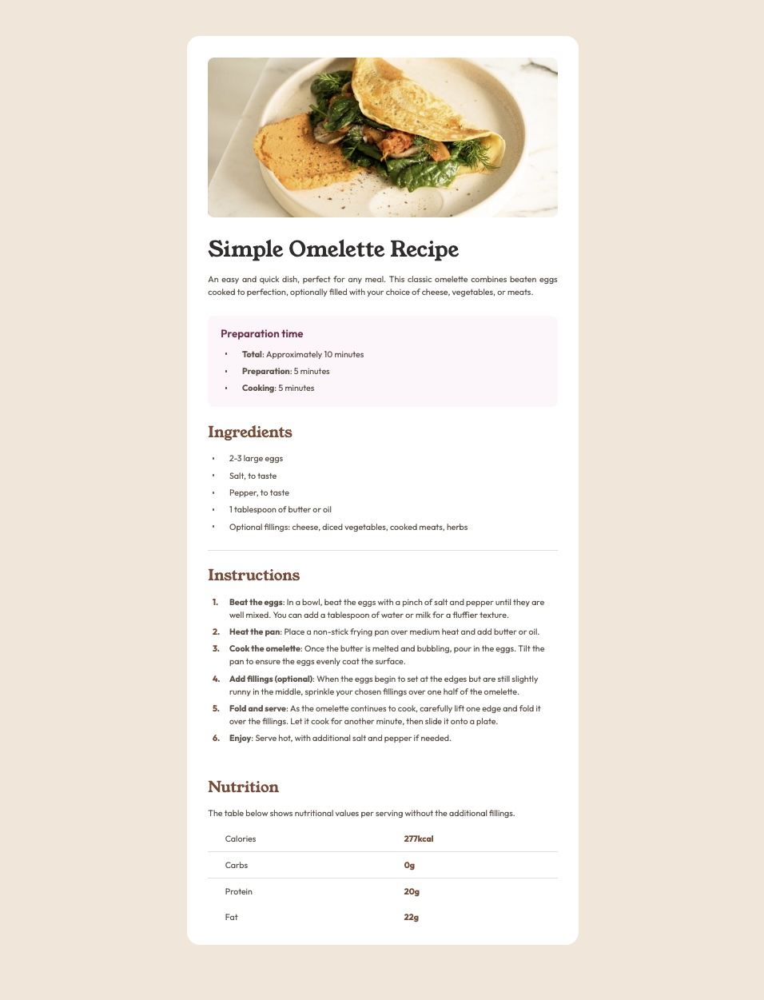

# Frontend Mentor - Recipe page solution

This is a solution to the [Recipe page challenge on Frontend Mentor](https://www.frontendmentor.io/challenges/recipe-page-KiTsR8QQKm). Frontend Mentor challenges help you improve your coding skills by building realistic projects.

## Table of contents

- [Overview](#overview)
  - [The challenge](#the-challenge)
  - [Screenshot](#screenshot)
  - [Links](#links)
- [My process](#my-process)
  - [Built with](#built-with)
  - [What I learned](#what-i-learned)
  - [Useful resources](#useful-resources)
- [Author](#author)

## Overview

### Screenshot



### Links

- Solution URL: [Solution](https://github.com/vince4dev/challenge4)
- Live Site URL: [Live site](https://vince4dev.github.io/challenge4/)

## My process

### Built with

- **HTML5**: Semantic structure and accessibility
- **CSS Grid**: Main layout and modular components
- **Pseudo-element `::before`**: For bullet points "ul" and numbered elements "ol"
- **Media Queries (`@media`)**: Responsive design (mobile-first/tablet/desktop)

### What I learned

**`::before` pseudo-element**: I learned to use `::before` to inject visual content without modifying the HTML. By combining `content: ""` with `position: absolute`.

```css
.recipe__prep--list li::before {
  content: "";
  position: absolute;
  top: calc(50% - (0.125rem));
  transform: translatex(-2em);

  width: 0.25rem;
  height: 0.25rem;
  background-color: var(--clr-Rose-800);
  border-radius: 50%;
}
```

### Useful resources

- [google-webfonts-helper](https://gwfh.mranftl.com/fonts) - This helped me find the font and integrate it into the project.
- [MDN](https://developer.mozilla.org/fr/) - Resources for Developers.

## Author

- Frontend Mentor - [@vince4dev](https://www.frontendmentor.io/profile/vince4dev)
